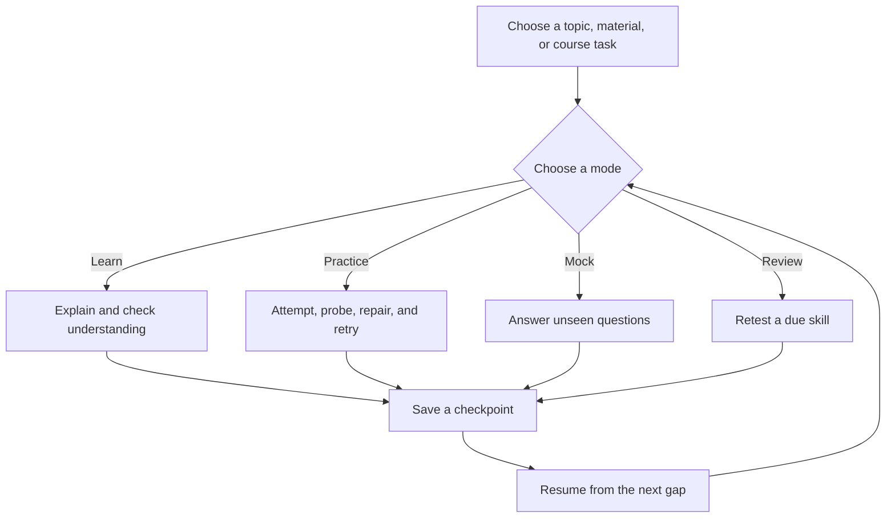

# KnowLoop

KnowLoop is an interview-coaching skill for technical interview preparation. It
uses one learning loop for algorithms, Python, system design, fundamentals,
SQL and data questions, behavioral questions, introductions, and resume projects:

> understand → attempt → probe → repair → retry → save → resume

The coach adapts to the answers it receives and resumes from saved evidence.

## Start

Install the `interview-coach` skill and the optional `$coach` shortcut, then
start with a topic, a piece of material, or a course task:

```text
$coach
$coach What should I learn today?
$interview-coach Practice Python with me.
$interview-coach Start a system design mock interview.
$interview-coach Review my last weak point.
```

Give the coach a subject, goal, language, or time limit when those details
matter. You can begin with reading, code, an introduction, or a real project;
you do not need to complete a course first.

## Four modes

| Mode | What happens |
| --- | --- |
| Learn | Explain the current material, then check understanding. |
| Practice | Let you answer first; probe, repair, and retry. |
| Mock | Ask one unseen interview question at a time, then debrief. |
| Review | Re-test a due skill with a fresh or changed-condition question. |

Use `$interview-coach` when you want this learning loop. Ordinary fact lookup,
code editing, and direct explanations can remain ordinary conversation. Mock
interviews start only when you ask for one. Coach-authored examples do not count
as independent learner evidence.

## System design path

System design follows this progression:

`Functional Requirements → Non-functional Requirements → Core Entities → Data Flow → API / System Interface → High Level Design → Deep Dives`

Start a new design with requirements, then advance from the evidence in the
current stage. Learn, Practice, Mock, and Review can all use the same path.



## Checkpoints and privacy

After each assessable answer or retry, the coach synchronously saves a
checkpoint before moving to the next prompt, stage, mode, or wrap-up. Learners
do not run storage commands, write JSON or SQLite, or maintain a dashboard.

Learner records stay only in a local SQLite database under a private directory
outside this repository, installed skills, and other Git repositories. The
public repository contains general instructions, course data, and synthetic
examples. Records are not uploaded automatically.

The dashboard is opt-in. Only an explicit request opens a transient loopback
view at `127.0.0.1`; it reads directly from SQLite, keeps display state in
memory, and closes after page load or a bounded timeout. Saving never creates a
learner HTML or JSON report.

## Minimal installation

Requirements: Python 3.10 or newer for local storage. No database server,
Node.js installation, or voice service is required.

From a checkout of this repository, copy the two skills into your Codex skills
directory:

```sh
mkdir -p ~/.codex/skills
cp -R interview-coach coach ~/.codex/skills/
```

If `CODEX_HOME` is configured, use its `skills/` directory instead. Then start
`$coach` or `$interview-coach` in Codex.

## Public pages

The publishable output is limited to the local `docs/` catalog,
`docs/courses.json`, and the explicitly synthetic `docs/dashboard-demo.html`.
These pages contain public course and demonstration data only; private learner
records remain in local SQLite.
